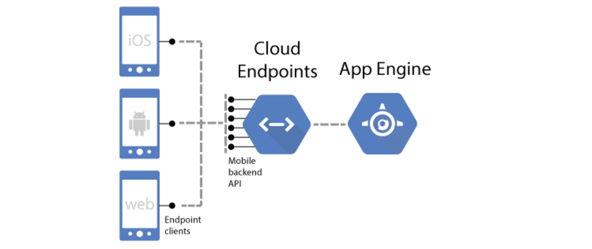
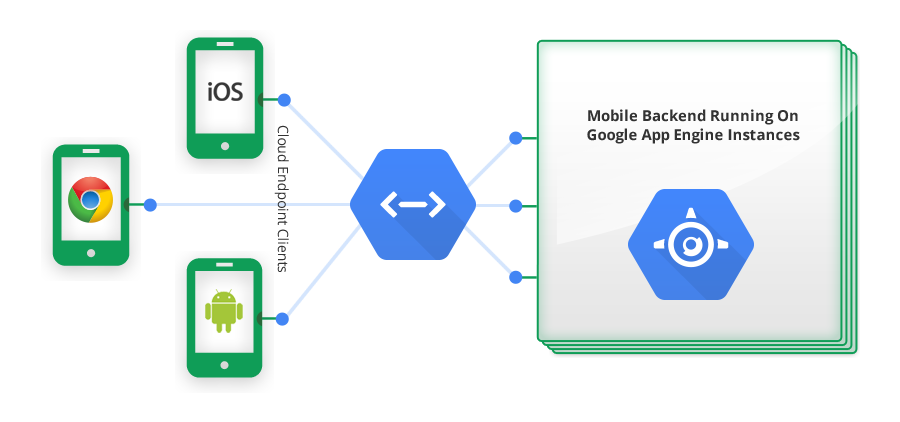

[How to build backend services for mobile apps](https://cloud.google.com/solutions/mobile/mobile-app-backend-on-cloud-platform)

**Design patterns**:

- Firebase
	- provides automatic data synchronization and authentication services	
- Firebase & App Engine
	- If your app needs to process user data or orchestrate events, extending Firebase with App Engine gives you the benefit of automatic real-time data synchronization.	
- Firebase & Managed VMs
	- The difference is that App Engine Managed VMs runs your backend service inside Docker containers that you can configure. This means you can call native binaries, write to the file system, and make other system calls.	
- App Engine & Endpoints
	- 
	- Google Cloud Endpoints generates APIs, client libraries, and discovery documentation for an App Engine application. Using Cloud Endpoints means you don’t have to write wrappers to handle communication with App Engine. With the client libraries generated by Cloud Endpoints, you can simply make direct API calls from your mobile app.	
	- 
- Compute Engine & REST/gRPC
	- Compute Engine lets you create and run virtual machines on Google infrastructure. You have administrator rights to the server and full control over its configuration. This also means that you are responsible for updates and maintenance.

#Google Cloud Endpoint

###[Endpoint Annotations](https://cloud.google.com/appengine/docs/java/endpoints/annotations)

[Creating a Simple Hello World Backend API](https://cloud.google.com/appengine/docs/java/endpoints/getstarted/backend/hello_world)
