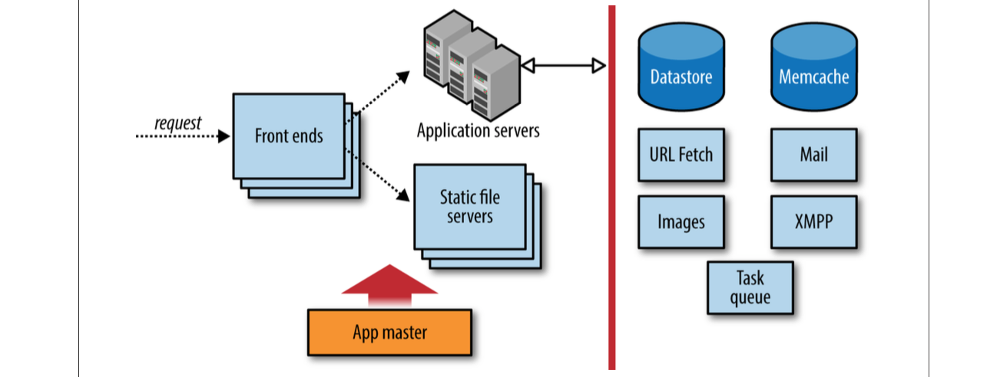

# Google App Engine 
Platform as a Service

> Google App Engine is a platform for building scalable web applications and mobile backends. App Engine provides you with built-in services and APIs such as NoSQL datastores, memcache, and a user authentication API, common to most applications.

> App Engine will scale your application automatically in response to the amount of traffic it receives so you only pay for the resources you use. Just upload your code and Google will manage your app's availability. There are no servers for you to provision or maintain.

-- [appengine](https://cloud.google.com/appengine/)

**Google App Engine** (**GAE**)

## 1 Introducing Google App Engine

- GAE is a web application hosting service.
- GAE can serve Traditional website content too.
- When an application can serve many simultaneous users without degrading performance, we say it scales. 
	- Applications written for App Engine scale automatically.
- every developer gets a certain amount of resources for free, enough for small applications with low traffic.
- App Engine is part of Google Cloud Platform.
- An App Engine web application can be described as having three major parts: 
	1. application instances
	2. scalable data storage
	3. scalable services

- App Engine allows runtime environments to outlive request handlers, and will reuse environments as much as possible to avoid unnecessary initialization. 
- Each instance of your application has local memory for caching imported code and initialized data structures. 
- App Engine creates and destroys instances as needed to accommodate your app’s traffic. 

- App Engine provides a separate set of servers dedicated to delivering static files.

**Cloud datastore**

- Google Cloud SQL, a full-featured relational database service based on MySQL. Cloud SQL is a feature of Google Cloud Platform, and can be called directly from App Engine using standard database APIs.
- Cloud Datastore scales automatically: with proper data design, it can handle as many simultaneous users as App Engine’s server instances can.


**Transactions**

- an update of a single entity occurs in a transaction. Each transaction is atomic: the transaction either succeeds completely or fails completely,
- An application can read or update multiple entities in a single transaction, but it must tell Cloud Datastore which entities will be updated together when it creates the enti‐ ties. The application does this by creating entities in entity groups. Cloud Datastore uses entity groups to control how entities are distributed across servers

**Services**

- Google Cloud Platform provides another storage service specifically for very large values, called Google Cloud Storage.2 Your app can use Cloud Storage to store, man‐ age, and serve large files, such as images, videos, or file downloads. 
- Google Cloud SQL provides full- featured MySQL database hosting. Unlike Cloud Datastore or Cloud Storage, Cloud SQL does not scale automatically. 

- App Engine applications can access other web resources using the URL Fetch service.

- can use Google Accounts as your app’s user authentication system, so you don’t have to build your own.

- can always build your own account system, or use an OpenID provider.

- App Engine includes built-in support for OAuth, a protocol that makes it possible for users to grant permission to third-party applications to access personal data in another service, without having to share their account credentials with the third party. 
 
- Endpoints make it especially easy for a mobile or rich web client to call methods on the server. Endpoints includes libraries and tools for generating server functionality from a set of methods in Python and Java, and generating client code for Android, iOS, and browser-based JavaScript. The tools can also generate a “discovery document” that works with the Google APIs Cli‐ ent Libraries for many client languages. And OAuth support is built in, so you don’t have to worry about authentication and can just focus on the application logic.

- Task queues let you describe work to be done at a later time, outside the scope of the web request. 
- There are two kinds of task queues: push queues and pull queues:
	- push queues, each task record represents an HTTP request to a request handler. App Engine issues these requests itself as it processes a push queue.
	- pull queues, you provide the mechanism, such as a custom computational engine, that takes task records off the queue and does the work.

-  storage services provide this partitioning feature at the infrastructure level. An app can declare it is acting in a namespace by calling an API.

- **Google Cloud SDK**
	- Google Cloud SDK contains tools and libraries that enable you to easily create and manage resources on Google Cloud Platform, including App Engine, Compute Engine, Cloud Storage, BigQuery, Cloud SQL, and Cloud DNS.
	- [https://cloud.google.com/sdk/](https://cloud.google.com/sdk/)

- creating app engine app
	- [https://console.developers.google.com/start/appengine](https://console.developers.google.com/start/appengine)
- App Engine documentation [https://cloud.google.com/appengine/docs](https://cloud.google.com/appengine/docs)

## 2 creating an Application

- The Google Cloud SDK is a collection of tools and libraries for developing, testing, and deploying software for the Cloud Platform, including App Engine. 
- App Engine Java apps use interfaces and features from Java Platform, Enterprise Edi‐ tion (Java EE).
- The App Engine SDK includes implementations for the relevant Java EE features. 

Restart shell

```shell
exec -l $SHELL
```

start:

```shell
./Development/google-cloud-sdk/bin/gcloud init
```

run gcloud command for help:

```shell
./Development/google-cloud-sdk/bin/gcloud -h
```

- Java web applications for App Engine use the Java Servlet standard interface for inter‐ acting with the application server.

- An application consists of one or more servlet classes, each extending a servlet base class. Servlets are mapped to URLs using a stan‐ dard configuration file called a “deployment descriptor,” also known as web.xml.

- When App Engine receives a request for a Java application, it determines which servlet class to use based on the URL and the deployment descriptor, instantiates the class, and then calls an appropriate method on the servlet object.

- All the files for a Java application, including the compiled Java classes, configuration files, and static files, are organized in a standard directory structure called a Web Application Archive, or “WAR.”
	- Everything in the WAR directory gets deployed to App Engine.

- App Engine needs one additional configuration file that isn’t part of the servlet standard. Open or create the file war/WEB-INF/appengine-web.xml,

- start the development server, using the ```dev_appserver``` command.

## 3 Configuring an Application

- App Engine does all the heavy lifting of accepting incoming TCP/IP connections, reading HTTP request data, ensuring that an instance of your app is running on an applica‐ tion server, routing the request to an available instance, calling the appropriate request handler code in your app, and collecting the response from the handler and sending it back over the connection to the client.


-  can configure the frontend to handle different requests in different ways.
	- For instance, you can tell the frontend to route requests for some URLs to App Engine’s static file servers instead of the application servers, for efficient delivery of your app’s images, CSS, or JavaScript code.

App Engine request handling architecture:



- The frontends, app servers, and static file servers are governed by an “app master.”

**configuring a java app**

- A Java application consists of files bundled in a standard format called WAR (short for “web application archive”). The WAR standard specifies the layout of a directory structure for a Java web application, including the locations of several standard con‐ figuration files, compiled Java classes, JAR files, static files, and other auxiliary files. Some tools that manipulate WARs support compressing the directory structure into a single file similar to a JAR. App Engine’s tools generally expect the WAR to be a direc‐ tory on your computer’s filesystem.

> Java servlet applications use a file called a “deployment descriptor” to specify how the server invokes the application. This file uses an XML format, and is part of the servlet standard specification.

- App Engine uses dedicated servers for static files. Using dedicated servers also means the app servers don’t have to spend resources on requests for static files.

- tell the deployment process and the frontend which of the application’s files are static files using app configuration. 

- The static file configuration can also include a recommendation for a cache expira‐ tion interval. App Engine returns the cache instructions to the client in the HTTP header along with the file.


- To save space and reduce the amount of data involved when setting up new app instances, static files are not pushed to the application servers. This means application code cannot access the contents of static files by using the filesystem.

- Typically, files outside of WEB-INF/ represent resources that the user can access directly,

By default, all files in the WAR are pushed to the application servers, and are accessi‐ ble by the application code via the filesystem. This includes the files that are identified as static files and also copied to the static file servers. In other words, all files are con‐ sidered resource files, and all files except for JSPs and files in the WEB-INF/ directory are considered static files.

- to change it:
	- using the appengine-web.xml file, with the <resource-files> and <static-files> elements, respectively. These elements can contain <include> and <exclude> elements that modify the default behavior of including all files.

```xml
<resource-files>
	<exclude path="/images/**" />
</resource-files>

<static-files>
	<exclude path="/**.xml" /> <include path="/sitemap.xml" />
</static-files>
```

> The ** pattern matches any number of characters in file and directory names, including subdirectories.

**Files in the WEB-INF/ directory are always considered resource files. They cannot be included as static files or excluded from the set of resource files.**

**Domain Names**

- Every app gets a free domain name on appspot.com, based on the application ID.
	- `http://app-id.appspot.com/path...`

**Google Apps**

> Google Apps is currently the only way to use secure connections (SSL/TLS, aka “HTTPS”) with custom domains on App Engine.

- make the Apps domain’s administrator account an owner of the app. This is required for setting up secure connections. There are three parts to this: adding the Cloud Console as an “app” that the domain admin can use, inviting the domain admin to be an owner of the app, and finally accepting the invita‐ tion as the domain admin. (You must add the Cloud Console as a service before the domain admin can accept the invitation.)

**Configuring Secure connections**

- App Engine accepts HTTPS connections for all URLs, and otherwise treats them like HTTP requests. 

- All URL paths can be configured to use secure connections, including those mapped to application code and those mapped to static files. The frontend takes care of the secure connection on behalf of the app servers and static file servers.

> App Engine only supports secure connections over TCP port 443

## 4 Request Handlers and Instances

## build

Run this command to install dependencies and do a clean build:

``` shell
mvn clean install
```

Testing app

```shell
mvn appengine:devserver
```

http://localhost:8080/

Upload app:

```shell
mvn appengine:update
```


##Sources:

Programming Google App Engine with Java
- Build & Run Scalable Java Applications on Google's Infrastructure

- [https://cloud.google.com/appengine/docs/java/](https://cloud.google.com/appengine/docs/java/)
