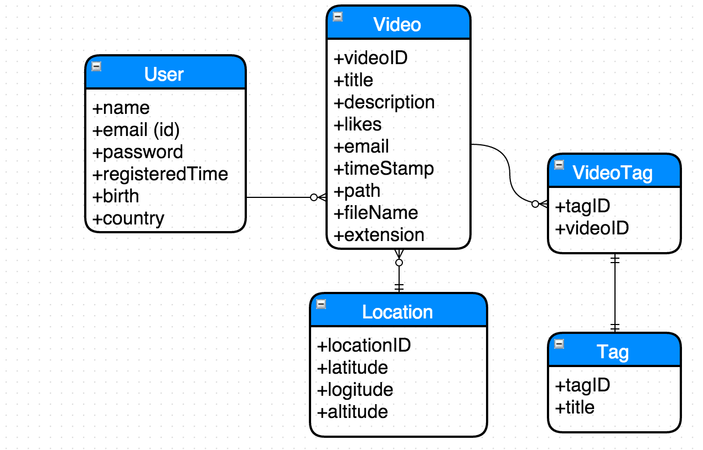

#Spring framework, Hibernate ORM
##content

- Many to Many ORM
- One to Many ORM
- Many to One ORM

##entity relationship diagram

(this is a general view, some attributes might be different from the real Class)

