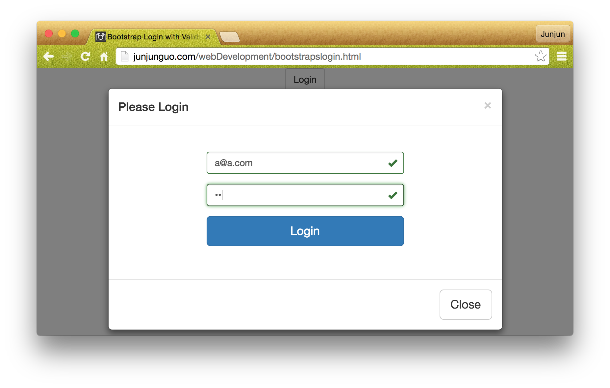

#Responsive design

##Bootstrap framework

###Bootstrap Login with modal and custom validation

HTML5 validation message:


Responsive helping message:


Error icon and color:


Error sign:


Succeed icon and color:



Welcome back window:


###Bootstrap Register

####1

- Html5 default validation message with tips information 
    - and custom text
- Bootstrap succeed icon + green border
- Bootstrap error icon  + read border


Use Javascript to dynamically change between:

- Bootstrap succeed icon + green border
- Bootstrap error icon  + read border

```javascript 
if (firstname.validity.valid) {
            document.getElementById('form-group-first-name').className =
                "form-group has-success has-feedback";
            document.getElementById('form-span-first-name').className =
                "glyphicon glyphicon-ok form-control-feedback";
        } else {
            document.getElementById('form-group-first-name').className =
                "form-group has-error has-feedback";
            document.getElementById('form-span-first-name').className =
                "glyphicon glyphicon-remove form-control-feedback";
        }
```
####2

- Bootstrap warning icon + yellow border
    - custom text
    - custom validation message


- Dynamically change text information by change `title`.
- Dynamically change custom validation by set custom validity

```javascript
document.getElementById('inputEmail').title = inputemail + " is already registered!";
document.getElementById('inputEmail').setCustomValidity(inputemail + " is already registered!");
```

####3
Custom text in addition to default validation message:


- use `pattern` to limit input
    - `pattern=".{minimum-number,maximum-number}"`
- tag that this field of input is `required`
- add custom text to `title`
    - this will show when mouse over the input field
    - and will be added in addition to validation message

```html
<input ... pattern=".{4,}" required title="password too short !">
```

####4
Custom validation message (override the default):


- add `oninvalid` to input for set custom validation message
- and clean the message when the input changes by change `oninput`

```html
<input ... oninvalid="this.setCustomValidity('Your custom message her!')"
           oninput="setCustomValidity('')" ...>
```


####5
Bootstrap responsive window size narrow:


Bootstrap divide window to 12 grids

- here when it is `col-sm-6 col-md-6` 
    - small window (narrow) or medium window 
        - each column will take half of it parent size (6 of 12)
- when extra small window (narrower) 
    - the column will take all its parent size (12 of 12)
    - see next screen capture with narrower window
        
`<div class="col-xs-12 col-sm-6 col-md-6">`

####6
Bootstrap responsive window size narrower:


####7
Terms and Conditions modal on top of register modal:


How to close the on top modal only ?

- only close the on top modal when close is clicked.

By default when the on top modal `close` is triggered the parent modal will be closed as well.
Most of the time we only want to close the window (modal) we clicked at.

By doing so, my solution is control modal show and hide in Javascript:

- When register button is clicked we open `#registerModal` by `modal('show')`.
   - when open child is called we open child modal by `modal('show')` 
        - when close child button is clicked we close it with `modal('hide')`
        - see code bellow: 
        
```javascript
$('#registerModal').modal('show');
$('#btn-t-c').click(function () {
    $('#t_and_c_m').modal('show');
    $('.hide-t-c').click(function () {
        $('#t_and_c_m').modal('hide');
    });
});
```

####8
Congratulations modal on top of register modal:


Close all window after 4 seconds:

```javascript
setTimeout( 
    function () {
        $('#registerModal').modal('hide');
        $('#register-succeed').modal('hide');
    }, 4000);
```                    
