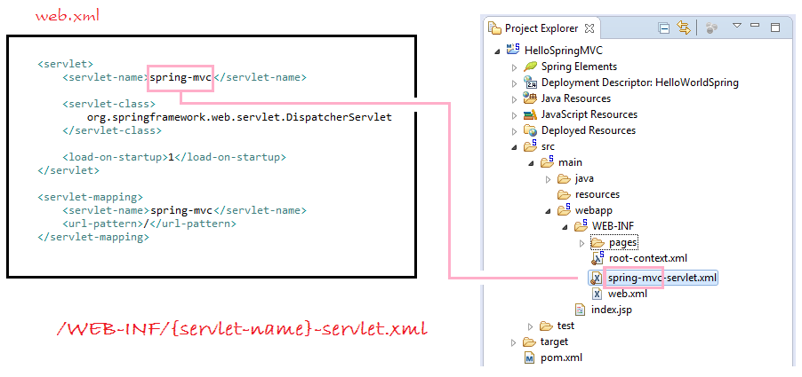
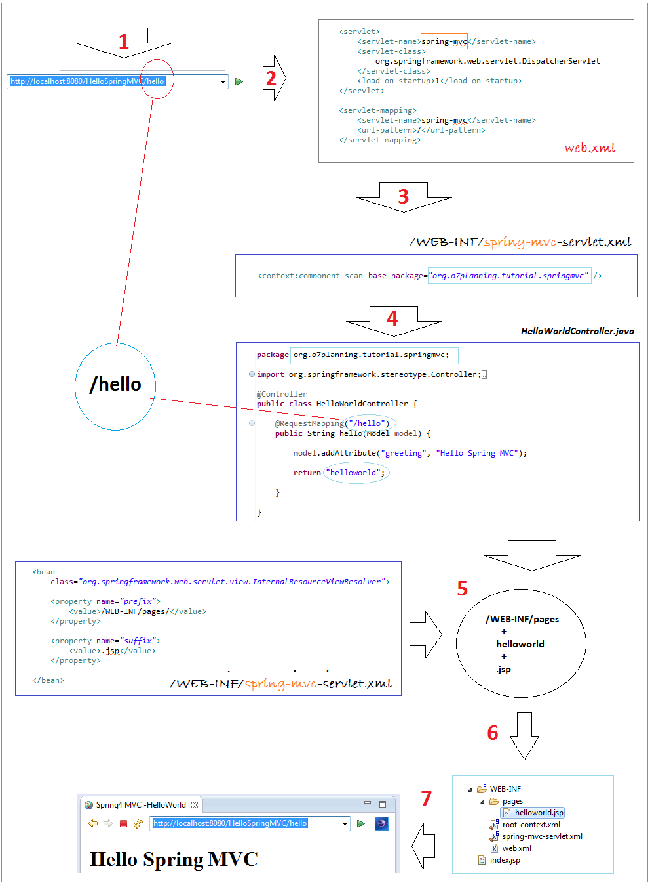
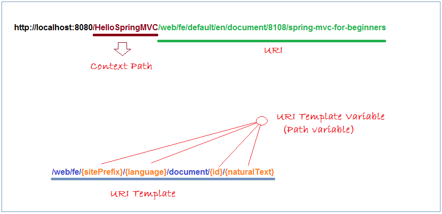

#SpringMVC Hibernate MySQL Maven

From [WebSystique](http://websystique.com/springmvc/spring-4-mvc-and-hibernate4-integration-example-using-annotations/) tutorial.


##working flow:
Spring MVC DispatcherServlet will read xml configuration file on the principle:





use the @PathVariable annotation on a method argument to bind it to the value of a URI template variable:
For example:
/web/fe/{sitePrefix}/{language}/document/{id}/{naturalText}



```java
@Controller
public class PathVariableExampleController {
    /**
     * @PathVariable Example:
     *
     * <pre>
     *
     *   http://o7planning.org/web/fe/default/en/document/8108/spring-mvc-for-beginners
     *   
     *   or
     *   
     *   http://localhost:8080/HelloSpringMVC/web/fe/default/en/document/8108/spring-mvc-for-beginners
     *
     * </pre>
     */
    @RequestMapping("/web/fe/{sitePrefix}/{language}/document/{id}/{naturalText}")
    public String documentView(Model model,
            @PathVariable(value = "sitePrefix") String sitePrefix,
            @PathVariable(value = "language") String language,
            @PathVariable(value = "id") Long id,
            @PathVariable(value = "naturalText") String naturalText) {
        model.addAttribute("sitePrefix", sitePrefix);
        model.addAttribute("language", language);
        model.addAttribute("id", id);
        model.addAttribute("naturalText", naturalText);
        String documentName = "Java tutorial for Beginners";
        if (id == 8108) {
            documentName = "Spring MVC for Beginners";
        }
        model.addAttribute("documentName", documentName);
        return "documentView";
    }
}
```

[image and code source: o7planning](http://o7planning.org/web/fe/default/en/document/8108/spring-mvc-tutorial-for-beginners)


