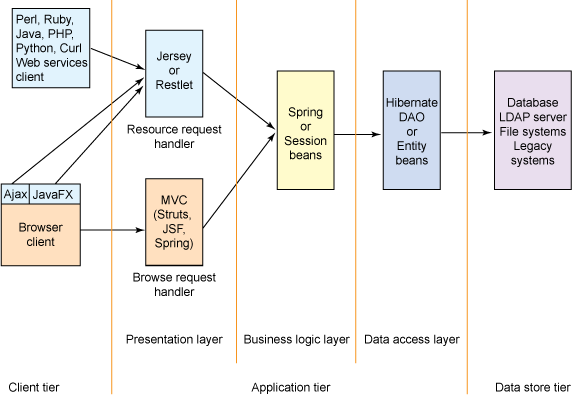

#Spring MVC REST Web Services CRUD 


[stackoverflow: What is RESTful?](http://stackoverflow.com/questions/671118/what-exactly-is-restful-programming)

[wikipedia](https://en.wikipedia.org/wiki/Representational_state_transfer):

- Representational State Transfer (REST) is the software architectural style of the World Wide Web.
- To the extent that systems conform to the constraints of REST they can be called RESTful. RESTful systems typically, but not always, communicate over the Hypertext Transfer Protocol with the same HTTP verbs (GET, POST, PUT, DELETE, etc.) which web browsers use to retrieve web pages and to send data to remote servers.

[How I explained REST to my wife](http://www.looah.com/source/view/2284)

##CRUD (Create, Read, Update, Delete)

- To create a resource on the server, use **POST**.
- To retrieve a resource, use **GET**.
- To change the state of a resource or to update it, use **PUT**.
- To remove or delete a resource, use **DELETE**.

###Request
```
GET /user
Accept: application/json+userdb
```
###Request: create new user
```
POST /user
Accept: application/json+userdb
Content-Type: application/json+userdb
{
    "name": "Karl",
    "country": "Austria"
}
```

##Controller
[WebSystique tutorial](http://websystique.com/springmvc/spring-mvc-4-restful-web-services-crud-example-resttemplate/)
####@RestController : 
First of all, we are using Spring 4′s new @RestController annotation. This annotation eliminates the need of annotating each method with @ResponseBody. Under the hood, @RestController is itself annotated with @ResponseBody, and can be considered as combination of @Controller and @ResponseBody.

####@RequestBody : 
If a method parameter is annotated with @RequestBody, Spring will bind the incoming HTTP request body(for the URL mentioned in @RequestMapping for that method) to that parameter. While doing that, Spring will [behind the scenes] use HTTP Message converters to convert the HTTP request body into domain object [deserialize request body to domain object], based on ACCEPT or Content-Type header present in request.

####@ResponseBody : 
If a method is annotated with @ResponseBody, Spring will bind the return value to outgoing HTTP response body. While doing that, Spring will [behind the scenes] use HTTP Message converters to convert the return value to HTTP response body [serialize the object to response body], based on Content-Type present in request HTTP header. As already mentioned, in Spring 4, you may stop using this annotation.

ResponseEntity is a real deal. It represents the entire HTTP response. Good thing about it is that you can control anything that goes into it. You can specify status code, headers, and body. It comes with several constructors to carry the information you want to sent in HTTP Response.

####@PathVariable 
This annotation indicates that a method parameter should be bound to a URI template variable [the one in '{}'].

Basically, @RestController , @RequestBody, ResponseEntity & @PathVariable are all you need to know to implement a REST API in Spring 4. Additionally, spring provides several support classes to help you implement something customized.

MediaType : With @RequestMapping annotation, you can additionally, specify the MediaType to be produced or consumed (using produces or consumes attributes) by that particular controller method, to further narrow down the mapping.

##[A multi-tier architecture for building RESTful Web services](http://www.ibm.com/developerworks/library/wa-aj-multitier/)
####Diagram of a multi-tiered Web application environment



##[REST API: guide](https://parse.com/docs/rest/guide)
