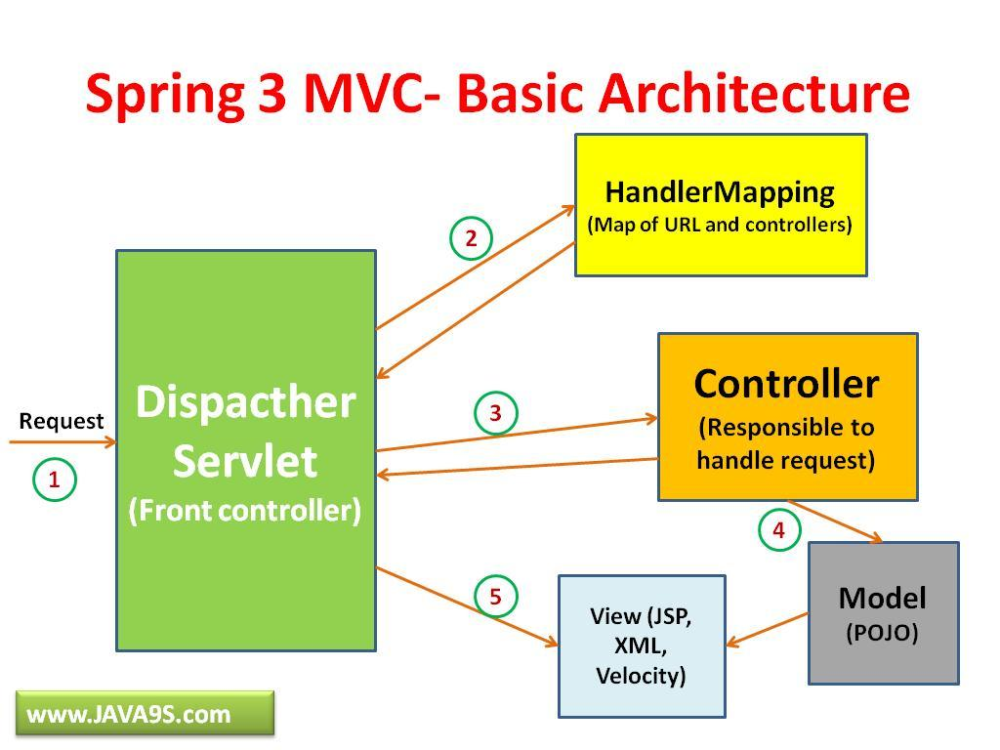

##Issues need to remember :)


####Spring considers that anything behind the last dot is a file extension 
- use: `/somepath/{variable:.+}`
to mapping parameter include .extension

####need default constructor in model for REST to build object from Json string (when geting response from server and use spring.rest method to get object)

##- hascode()
###- equals()
The theory (for the language lawyers and the mathematically inclined):

> equals() (javadoc) must define an equivalence relation (it must be reflexive, symmetric, and transitive). In addition, it must be consistent (if the objects are not modified, then it must keep returning the same value). Furthermore, o.equals(null) must always return false.

- hashCode() (javadoc) must also be consistent (if the object is not modified in terms of equals(), it must keep returning the same value).

The relation between the two methods is:

> Whenever a.equals(b), then a.hashCode() must be same as b.hashCode().

- hascode() & equals() : http://stackoverflow.com/questions/27581/what-issues-should-be-considered-when-overriding-equals-and-hashcode-in-java?rq=1

> hashCode() is used for bucketing in Hash implementations like HashMap, HashTable, HashSet, etc.

> The value received from hashCode() is used as the bucket number for storing elements of the set/map. This bucket number is the address of the element inside the set/map.

> When you do contains() it will take the hash code of the element, then look for the bucket where hash code points to. If more than 1 element is found in the same bucket (multiple objects can have the same hash code), then it uses the equals() method to evaluate if the objects are equal, and then decide if contains() is true or false, or decide if element could be added in the set or not.

> Create: 	put
> Read:		get
> Update:	post
> Delete:	delete

> CRUD: request  <-> controller <--> services <---> model 
> web  <--> build a new controller ...

#Spring mvc 


#structure
```
spring/tsag/
├── README.md
├── pom.xml
├── src
│   ├── main
│   │   ├── java
│   │   │   └── com
│   │   │       └── junjunguo
│   │   │           └── tsag
│   │   │               ├── configuration
│   │   │               │   ├── AppConfiguration.java
│   │   │               │   └── AppInitializer.java
│   │   │               ├── controller
│   │   │               │   ├── UserController.java
│   │   │               │   └── VideoController.java
│   │   │               ├── dao
│   │   │               │   ├── UserDao.java
│   │   │               │   ├── VideoDao.java
│   │   │               │   └── daoImpl
│   │   │               │       ├── UserDaoImpl.java
│   │   │               │       └── VideoDaoImpl.java
│   │   │               ├── model
│   │   │               │   ├── Location.java
│   │   │               │   ├── User.java
│   │   │               │   └── Video.java
│   │   │               └── service
│   │   │                   ├── UserService.java
│   │   │                   ├── VideoService.java
│   │   │                   └── serviceImpl
│   │   │                       ├── UserServiceImpl.java
│   │   │                       └── VideoServiceImpl.java
│   │   ├── resources
│   │   └── webapp
│   └── test
│       └── java
│           └── com
│               └── junjunguo
│                   └── tsag
│                       ├── UserTestClient.java
│                       └── VideoTestClient.java
├── target
└── tsag.iml
``` 
####[How To Solve JSON infinite recursion Stackoverflow (with Spring and Jackson annotations)](http://keenformatics.blogspot.it/2013/08/how-to-solve-json-infinite-recursion.html)

####[Infinite Recursion with Jackson JSON and Hibernate JPA issue](http://stackoverflow.com/questions/3325387/infinite-recursion-with-jackson-json-and-hibernate-jpa-issue)

####[Handle bi-directional references using declarative method](http://wiki.fasterxml.com/JacksonFeatureBiDirReferences)

Annotations are:

- @JsonManagedReference is the "forward" part of reference: one that gets serialized normally, and handling of which triggers back-linkage for the other reference
    - Annotated property can be a bean, array, Collection (List, Set) or Map type, and it must be a bean property (handled by a property of type serialized using BeanSerializer
- @JsonBackReference is the "back" part of reference: it will be omitted from serialization, and re-constructed during deserialization of forward reference.
    - Annotated property must be of bean type

These annotations can be used for:

- Methods (getters and setters)  Fields

- but not for types (classes) or constructor arguments.

- Annotations take optional "name" parameter; if omitted default name is used. Name is needed to allow multiple reference pairs for one bean type.


###ManyToMany
###Bidirectional solution 1:

- added `cascade = {CascadeType.ALL}` at parent side, and `@mappedBy` at child side:
    - this makes the relation bidirectional, 
    - But there is a infinite recursive problem, since parent point to child and child point back again to parent.
    - to stop the recursive problem, we can add     
          - `@JsonBackReference` at child side and 
          - `@JsonManagedReference` at parent side.
          - there are other errors with this solution in this project!
          - so the simple and functional way for this project is simply add 
                - **`@JsonIgnore` at child side**
- then use '@JsonIgnore' at child side, to stop the infinite loop problem. After this added a get method at daoImpl to make it bidirectional again;
- solution 1 at **commit** `1ac2fe14475c42bd2d123029c78be2e4cb24d228`

###Bidirectional solution 2:
- 1. make it unidirectional first, by delete '`mappedBy`' and the pointing attribute
    - so the parent knows its child or children,
    - but it's children do not know their parent.
    - this is not good, we need to let the children be able to know their parent :)
- 2. user inner join and build parents list as a method at daoImpl
    - and direct it to controller so we have this service ready

#### the second methods looks difficult or have more coding
   - but in my practice it is much easier to handle 
   - no varies Json, no open section, No serializer found for class .................... errors

INNER JOIN

```
mysql> select * from user  inner join user_tag on user.email = user_tag.user_id;
+---------------+------------+---------+------+----------------+---------------------+---------------+--------+
| EMAIL         | BIRTH      | COUNTRY | NAME | PASSWORD       | REGISTEREDTIME      | user_id       | tag_id |
+---------------+------------+---------+------+----------------+---------------------+---------------+--------+
| lee@gmail.com | 2015-10-29 |         | Lee  | lee's password | 2015-10-29 01:04:46 | lee@gmail.com |      1 |
| lee@gmail.com | 2015-10-29 |         | Lee  | lee's password | 2015-10-29 01:04:46 | lee@gmail.com |      2 |
| lee@gmail.com | 2015-10-29 |         | Lee  | lee's password | 2015-10-29 01:04:46 | lee@gmail.com |      3 |
| lee@gmail.com | 2015-10-29 |         | Lee  | lee's password | 2015-10-29 01:04:46 | lee@gmail.com |      4 |
+---------------+------------+---------+------+----------------+---------------------+---------------+--------+
4 rows in set (0.00 sec)
```
get id = 1

```
mysql> mysql> select * from user  inner join user_tag on user.email = user_tag.user_id where tag_id = 1;
+---------------+------------+---------+------+----------------+---------------------+---------------+--------+
| EMAIL         | BIRTH      | COUNTRY | NAME | PASSWORD       | REGISTEREDTIME      | user_id       | tag_id |
+---------------+------------+---------+------+----------------+---------------------+---------------+--------+
| lee@gmail.com | 2015-10-29 |         | Lee  | lee's password | 2015-10-29 01:04:46 | lee@gmail.com |      1 |
+---------------+------------+---------+------+----------------+---------------------+---------------+--------+
```
only interested in the user table;
```
mysql> select user.* from user  inner join user_tag on user.email = user_tag.user_id where tag_id = 1;
+---------------+------------+---------+------+----------------+---------------------+
| EMAIL         | BIRTH      | COUNTRY | NAME | PASSWORD       | REGISTEREDTIME      |
+---------------+------------+---------+------+----------------+---------------------+
| lee@gmail.com | 2015-10-29 |         | Lee  | lee's password | 2015-10-29 01:04:46 |
+---------------+------------+---------+------+----------------+---------------------+
```